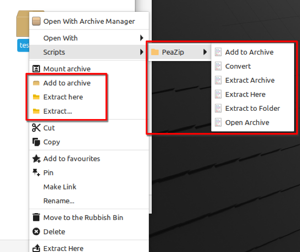

# PeaZip Context menu items for Nemo file manager

## What are these files for

They add PeaZip right-click context menu items to Nemo file manager (Nemo is the official file manager of the Cinnamon DE).

These files were tested on Linux Mint Cinnamon Edition.

## How to use the files

First decide which files do you need.
You can find one folder with scripts and one with actions.

On the first picture you can see both types. Scripts can be found under Scripts, the actions are directly in the context menu.

### Prerequisites

Install PeaZip as a Flatpak from the Software Manager.

**NOTE** These files require the Flatpak version, they will not work if you installed the .deb package from the PeaZip website.

### Scripts

1. The scripts do not support different languages. Rename them if you prefer them in another language.

2. Place them into the nemo scripts folder:
    1. Download the scripts

    2. Copy the scripts
    3. Navigate to ~/.local/share/nemo/scripts

        

    4. Press Enter

    5. Paste the scripts

        

3. Check "Allow executing file as a program" permission

    

4. Done

### Actions

Scripts and actions are functional the install instructions will be added later

