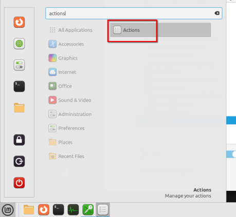
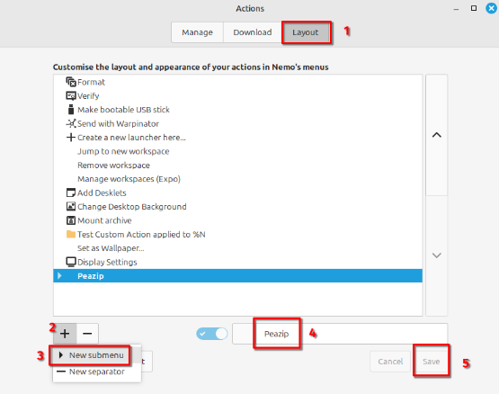
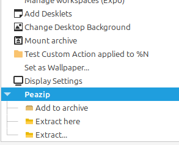

# PeaZip context menu items for Nemo file manager

## What are these files for

They add PeaZip right-click context menu items to Nemo file manager (Nemo is the official file manager of the Cinnamon DE).

These files were tested on Linux Mint Cinnamon Edition.

# How to use the files

First decide which files do you need. You can find one folder with scripts and one with actions in this repository.

Using only actions is recommended. Download scripts only if you need them.

On the first picture you can see both types. Scripts can be found under the Scripts submenu and the actions are directly in the context menu.

[!NOTE] 
If you have Linux Mint 22 you can group actions under a submenu like this.

## Prerequisites

Install the Flatpak version of PeaZip from the Software Manager.

[!IMPORTANT]
These files require the Flatpak version, they will not work if you installed the .deb package from the PeaZip website.

## Actions

Actions support other languages, check the [Supported Languages](Supported_Languages.md) list for more information.

### Install instructions
1. Place the icons in your icons folder:
    1. Download the [icons](https://github.com/xszabo3/peazip-context-menu-items-nemo/tree/main/icons) found in the icons folder

    2. Copy the icons
    3. Navigate to ~/.local/share/icons

        

    4. Press Enter

    5. Paste the icons into the folder

2. Place the actions into the nemo actions folder:
    1. Download the [actions](https://github.com/xszabo3/peazip-context-menu-items-nemo/tree/main/actions) found in the actions folder

    2. Copy the actions
    3. Navigate to ~/.local/share/nemo/actions

        

    4. Press Enter

    5. Paste the actions into the folder

3. Done

### How to group actions

This feature is available from Linux Mint **22**.

1. Open the **Actions** window.

    

2. Switch to the Layout tab

    

3. Click the **+** symbol and select the new submenu option
4. Choose a group name (in this case PeaZip)
5. Click *Save*
6. Now drag the actions on the new submenu with the mouse. The result will look like this:

    

7. Click *Save*

## Scripts

The scripts do not support different languages. Rename them if you prefer them in another language.

### Install instructions

1. Place the scritps into the nemo scripts folder:
    1. Download the [scripts](https://github.com/xszabo3/peazip-context-menu-items-nemo/tree/main/scripts) found in the scripts folder

    2. Copy the scripts
    3. Navigate to ~/.local/share/nemo/scripts

        

    4. Press Enter

    5. Paste the scripts into the folder

        

2. Check "Allow executing file as a program" permission

    

3. Done

## Sources

The files are **not** 100% written by me. You can find the license and copyright information of the original files in the files directly or in the accompanying note in the folder.

Here is a list of used sources

- [PeaZip](https://github.com/peazip/PeaZip/) - PeaZip is released under LGPLv3 by Giorgio Tani.

- [The original actions](https://github.com/badmotorfinger/nemo-peazip-context-menu/) are released under MIT by badmotorfinger.
